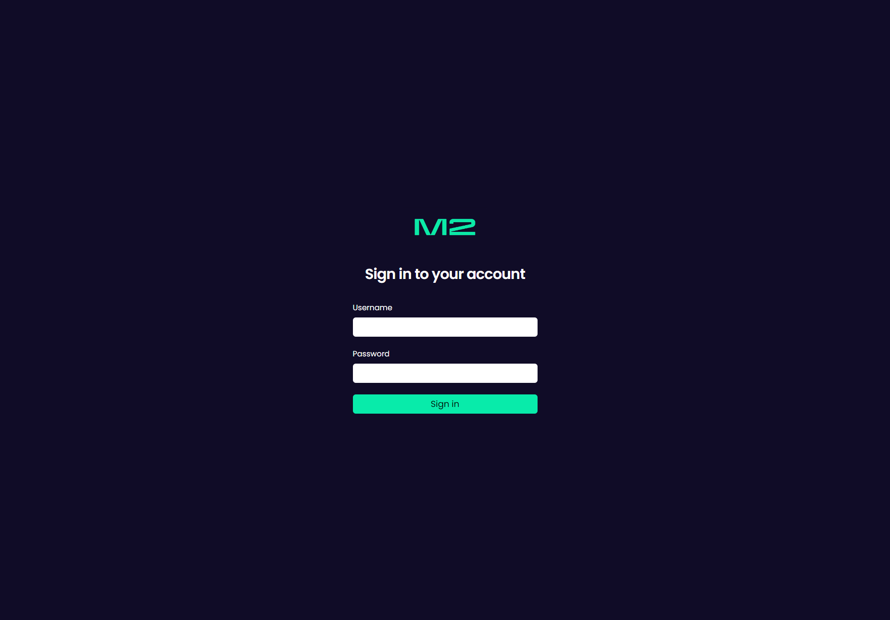
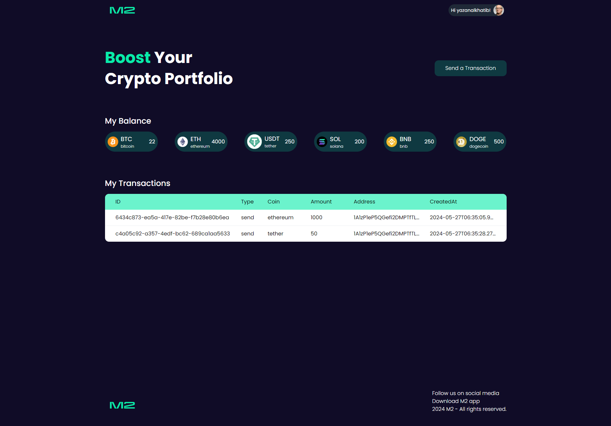
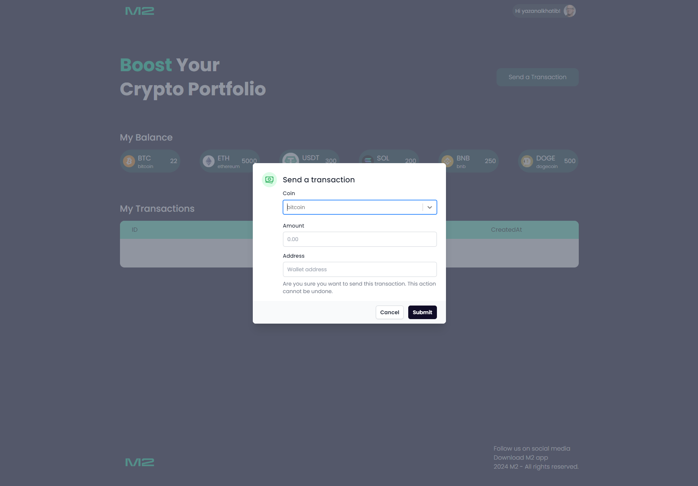

# Transactions Portal

Stablecoin Transaction Portal is a platform that allows you to trade virtual assets such as bitcoin and ethereum

- Check your Stablecoins balances
- Send transcations

### How to run the application

Backend:

- Navigate to `api` folder and run `yarn` to install all the dependencies
- Create a sql database locally using your SQL visualizing tool and edit the connection string in `src/db/database.provider.ts`

```
const dataSource = new DataSource({
        type: 'mysql',
        host: 'localhost',
        port: 3306,
        username: [db-username],
        password: [db-password],
        database: [db-name],
        entities: [__dirname + '/../**/*.entity{.ts,.js}'],
        synchronize: true,
      });
```

- Import the attached postman collection into postman `TransactionsPortal.postman_collection`
- Use the `register` endpoint to populate the db with a user along with starter stablecoin balances
- run `yarn start:dev` to automatically build the database and start the application

Frontend:

- navigate to `ui` folder and run `yarn` to install all the dependecies
- run `yarn dev` to start the project

## Screenshots

- Login page



- Homepage



- Creatign a transcation


